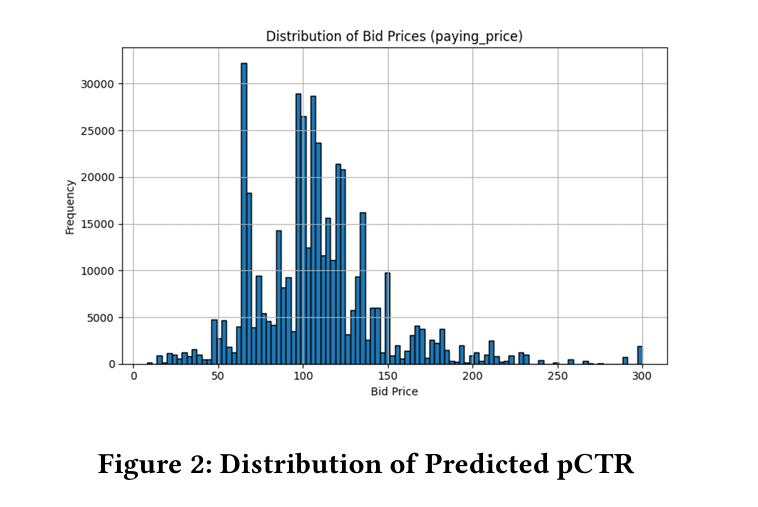

# Real-Time Bidding (RTB) Strategy Optimization under Budget Constraints

## Project Overview
This project explores the design of effective bidding strategies in a simulated **Real-Time Bidding (RTB)** environment. The goal is to maximize the number of acquired clicks under a strict budget constraint.

Starting from simple heuristics, the approach evolved to incorporate **Logistic Regression** and ultimately **LightGBM-based prediction models**. The final solution combines accurate Click-Through Rate (CTR) estimation with a linear bidding function adjusted by feature-based modifiers.

**[Read the Full Paper (PDF)](./RTB_Optimization_Paper.pdf)** *(Click the link above to view the detailed methodology and experimental results)*

---

## Key Methodology

The strategy development was divided into three phases, simulating a real-world iterative improvement process:

### Phase 1: Heuristic Baseline
* Implemented a rule-based system relying on domain intuition.
* **Signals:** Ad Slot Format, Hour of Day, Region.
* **Limitation:** Lacked adaptability to historical data and feature interactions.

### Phase 2: Logistic Regression
* Introduced a statistical baseline to predict **pCTR** (predicted CTR).
* **Bidding:** Quantile-based strategy (mapping probability tiers to fixed bid prices).
* **Outcome:** Improved over heuristics but failed to capture non-linear feature interactions.

### Phase 3: LightGBM & Linear Bidding (Final Solution)
* **Model:** Deployed **LightGBM** (Gradient Boosting Decision Tree) for robust pCTR estimation.
* **Feature Engineering:** Utilized label encoding for categorical features (Region, Ad Slot) to handle high cardinality.
* **Bidding Function:** Adopted a linear bidding formula with dynamic calibration:
    $$bid = base\_bid \times \left( \frac{pCTR}{avgCTR} \right)$$
* **Optimization:** Applied budget-aware clipping [1, 300] and floor smoothing to prevent overbidding on uncertain impressions.

---

## Experimental Results

* **Model Performance:** The LightGBM classifier achieved an **AUC of 0.741** on the validation set, significantly outperforming the logistic regression baseline.
* **Bidding Efficiency:** The linear bidding strategy successfully prioritized high-value impressions (e.g., Native ads in active hours) while adhering to the global budget constraint.

  
   
  <em>(Figure: Distribution of Predicted pCTR vs. Bid Prices)</em>

---

## 🛠 Tech Stack
* **Language:** Python
* **Machine Learning:** LightGBM, Scikit-learn
* **Data Processing:** Pandas, NumPy
* **Visualization:** Matplotlib

---

## 📝 Author
* **Tzu-Chun Chen** (National Cheng Kung University)
* *Note: This project was conducted as the final project for the Data Mining course.*
